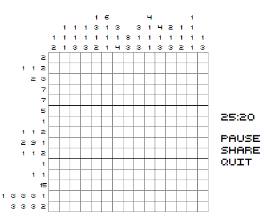
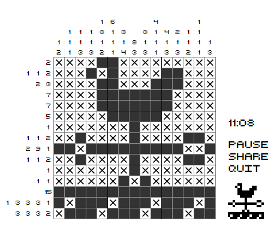

# verbocity
***verbocity*** is a puzzle game based on nonogram puzzles, where you fill in boxes, or “pixels,” in a grid to create a picture.  The game was inspired by Mario’s Picross for the GameBoy which I had many fun hours playing as a kid. :)

http://verbo.city

## How to Play

This is the game board

there are one or more numbers for each row and column in the grid--let’s take a look at one of the rows:

the numbers [1,3,3,3,1] indicate that there is a group of 1 pixel in a row, followed by one or more empty pixels, followed by a group of 3 pixels in a row, followed by one or more empty pixels, followed by a group of 3 pixels in a row, etc.  This works the same way for each column.  So, by cross-referencing the rows and columns (and occasionally using a little luck), we can solve the puzzle to create a picture:

Once you get the hang of it, you’ll start uncovering different strategies!

In verbocity, each puzzle must be solved within a 30-minute time limit.  To mark a pixel in the grid, use the **left mouse button**, or touch the pixel when on a touch device.  You can **click and drag** (or touch and drag) to select multiple pixels in a row or column.  To cancel a multi-pixel selection, click the **right mouse button while dragging**, or touch a second digit on the screen when on a touch device.  There is a time penalty for every pixel that is incorrectly marked, so take care and think things through!
You can also “flag” pixels to indicate that you know the pixel is not part of the solution.  To do this, click with the **right mouse button**, or enter “Flag” mode when on a touch device by toggling the switch at the top-right corner of the screen.

## Video Puzzles
There are some puzzles that are played in front of a music video.  The time limit for video puzzles is the length of the video, and a “strike” system is used for penalties in place of time penalties.
